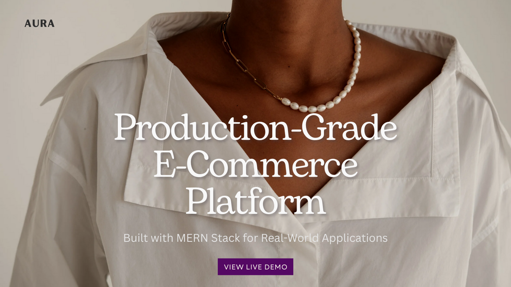
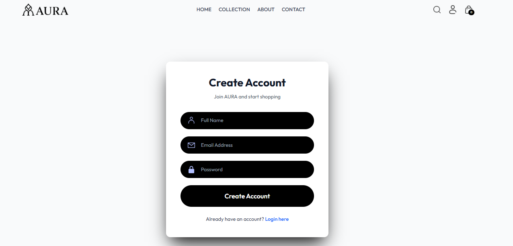
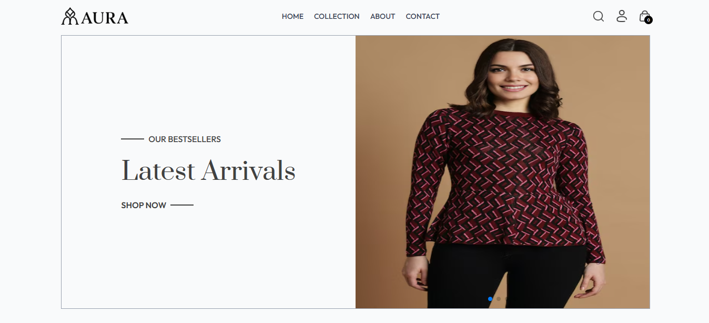
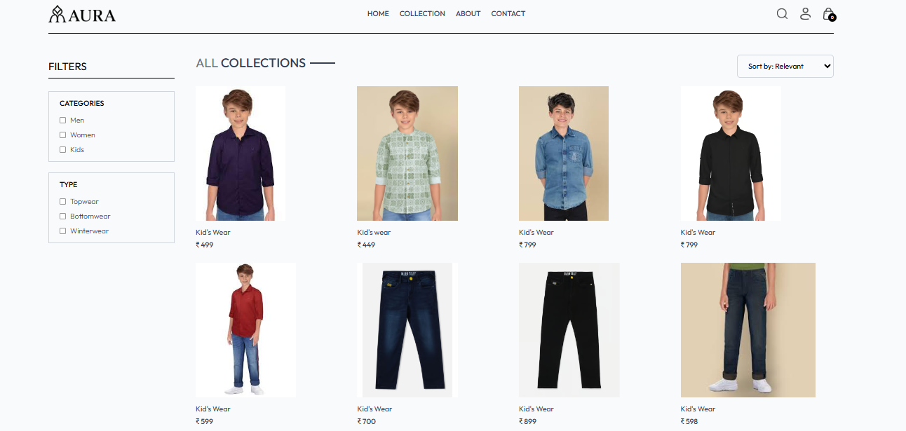
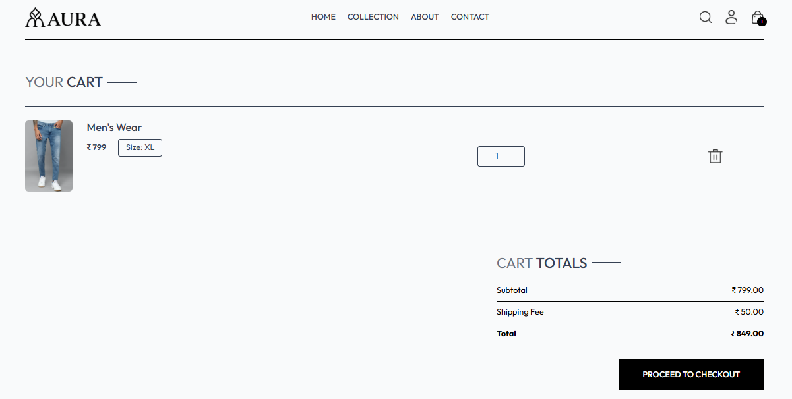
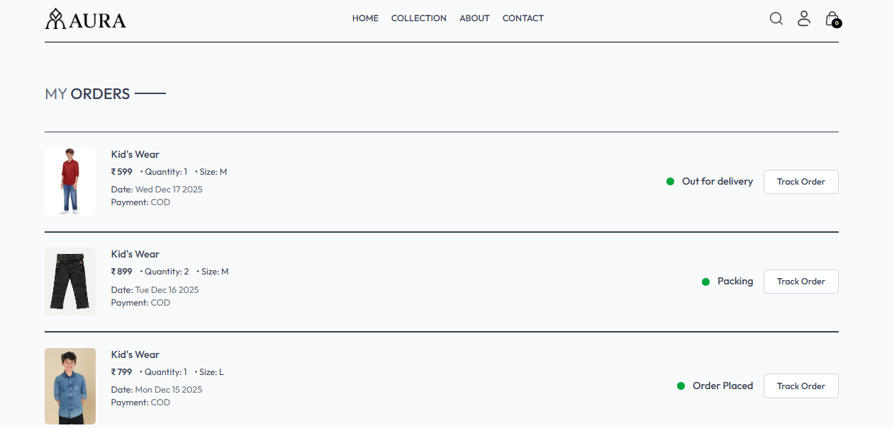
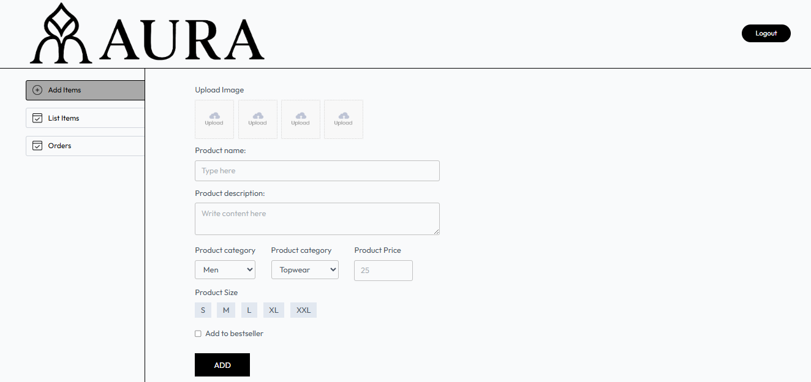
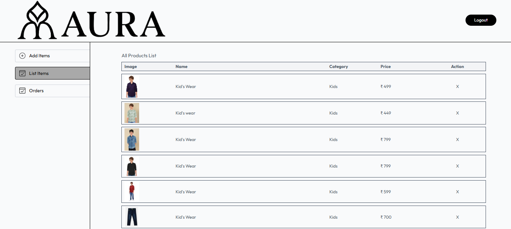
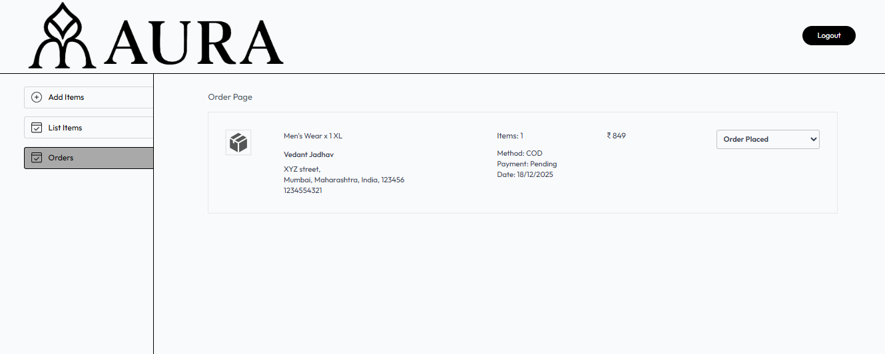

# 🛍️ AURA – Production-Grade Full Stack E-Commerce Platform

AURA is a **production-grade, full-stack e-commerce platform** engineered to demonstrate real-world software engineering practices. The project showcases **secure authentication, scalable backend architecture, clean frontend design, and admin-level business logic**, making it ideal for **recruiter evaluation, technical interviews, and portfolio review**. Built using the **MERN stack**, AURA follows industry-standard patterns used in modern SaaS and e-commerce systems.



---

## 📌 Table of Contents

* [Features](#-features)
* [Tech Stack](#-tech-stack)
* [Getting Started](#-getting-started)
* [Project Structure](#-project-structure)
* [Usage](#-usage)
* [Security Features](#-security-features)
* [Deployment](#-deployment)
* [Contributing](#-contributing)
* [Screenshots](#-screenshots)
* [Author](#-author)
* [Acknowledgments](#-acknowledgments)
* [Support](#-support)

---

## 🛡️ Badges

<p align="left">
  
  
  
  
  
  
</p>

---

## 🌟 Key Highlights

### 🛒 End-User Capabilities

* Secure user authentication (JWT + Cookies)
* Email verification system
* Browse products by category
* Product search & filtering
* Add/remove items from cart
* Place and track orders
* View order history
* Responsive shopping experience

### 🛠️ Admin & Business Logic

* Admin authentication & protected routes
* Add, update, and delete products
* Manage orders & order status
* User management
* Inventory-ready structure

### 🎨 UI / UX Engineering

* Clean, minimal UI design
* Fully responsive layout
* TailwindCSS styling
* Toast notifications
* Smooth navigation

---

## 🛠️ Technology Stack & Engineering Choices

### Frontend

* React.js
* Vite
* Tailwind CSS
* Axios
* React Router DOM
* Context API
* React Toastify

### Backend

* Node.js
* Express.js
* MongoDB (Mongoose)
* JWT Authentication
* bcryptjs
* Nodemailer
* Cookie-parser
* CORS

---

## 🚀 Getting Started (Local Development)

### Prerequisites

* Node.js (v14+)
* MongoDB Atlas
* SMTP email credentials

### Installation

Clone the repository:

```bash
git clone https://github.com/vedant0706/AURA_Website.git
cd AURA_Website
```

Install backend dependencies:

```bash
cd server
npm install
```

Install frontend dependencies:

```bash
cd client
npm install
```

Configure environment variables for both client and server.

Run the application:

Backend:

```bash
npm start
```

Frontend:

```bash
npm run dev
```

---

## 📁 Project Architecture

```bash
AURA_WEBSITE/
├── client/
│   ├── src/
│   │   ├── assets/
│   │   ├── components/
│   │   ├── pages/
│   │   ├── context/
│   │   └── App.jsx
│   └── package.json
│
├── server/
│   ├── config/
│   ├── controllers/
│   ├── models/
│   ├── routes/
│   ├── middleware/
│   └── server.js
│
└── README.md
```

---

## 🎯 Application Workflows

### Users

* Register & verify email
* Browse products
* Manage cart
* Place orders
* Track order history

### Admin

* Add & manage products
* Manage orders
* Monitor users

---

## 🔒 Security & Best Practices

* JWT authentication
* HTTP-only cookies
* Password hashing (bcrypt)
* Role-based route protection
* Secure CORS handling

---

## 🌐 Deployment & Production Readiness

* Frontend: Vercel
* Backend: Vercel / Render
* Database: MongoDB Atlas

```bash
vercel deploy --prod
```

---

## 🤝 Contribution Guidelines

Contributions are welcome!

```bash
git checkout -b feature/YourFeatureName
git commit -m "Add: YourFeatureName"
git push origin feature/YourFeatureName
```

Open a Pull Request 🚀

---

## 🖼️ Application Screenshots

* Login Page
  

* Home Page
  

* Collection Page
  

* Cart Page
  

* Order Page
  

* Admin Dashboard
  

* Admin List Page
  

* Admin Order Page
  

---

## 👨‍💻 About the Developer

**Vedant Jadhav**

* GitHub: [https://github.com/vedant0706](https://github.com/vedant0706)
* LinkedIn: [https://www.linkedin.com/in/vedant-jadhav-0b1947340](https://www.linkedin.com/in/vedant-jadhav-0b1947340)
* Portfolio: [https://jadhavvedant.vercel.app](https://jadhavvedant.vercel.app)

---

## 🙏 Acknowledgments & References

* React Community
* MongoDB Documentation
* TailwindCSS
* Open-source Contributors

---

## 📞 Contact & Support

For support, email: **[vedantjadhav173@gmail.com](mailto:vedantjadhav173@gmail.com)**
Or open an issue on GitHub.

---

## 🌐 Live Demo (Production)

🔗 [https://aurawebsite-eight.vercel.app](https://aurawebsite-eight.vercel.app)

<p align="center"><b>Built to demonstrate real-world full‑stack engineering skills.</b><br/>Made with ❤️ by <b>Vedant Jadhav</b></p>
